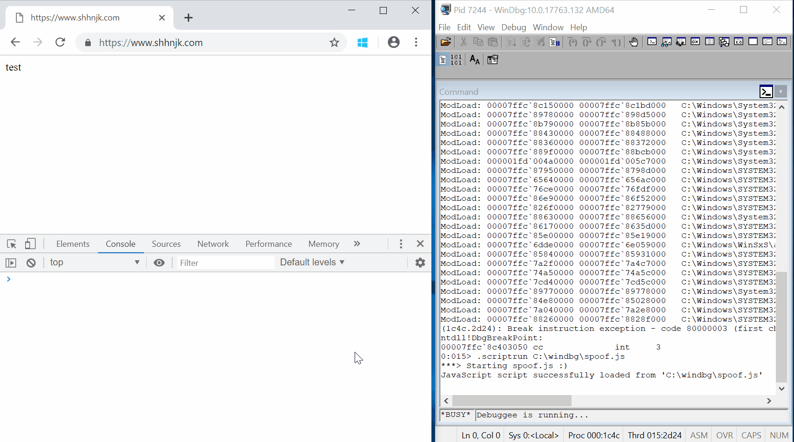

# spoof.js
`spoof.js` is a JavaScript debugger extension for WinDbg which helps spoof origin and url of Chrome's renderer process.

## How to use
Attach WinDbg to a renderer process, and run `.scriptrun C:\path\to\spoof.js`. Then you need to call `window.length` from the renderer process's Javascript in order to spoof origin and url. You need to have symbols for Chrome in WinDbg. See [WinDbg help](https://www.chromium.org/developers/how-tos/debugging-on-windows/windbg-help) for more details.

## Note
You can edit `target_url` and `target_host` in spoof.js to your desired target. The only requirement is that the length of original scheme and host in the renderer process should be same to the length of target scheme and host.
For example, if you navigate renderer process to `https://www.shhnjk.com`, you can set your `target_host` to `www.google.com`, but not to `www.apple.com`. This is because `"www.shhnjk.com".length // 14` and `"www.apple.com".length // 13` doesn't match.

## Tips for testing Site Isolation
Once origin and url are spoofed, you can call random Javascript API to see if that bypasses Site Isolation. If the renderer process crashes after calling some API (e.g. postMessage), it means Site Isolation detected that specific IPC call with spoofed origin/url.

Here is an example of Site Isolation bypass that was found using this script.
https://bugs.chromium.org/p/chromium/issues/detail?id=915398
